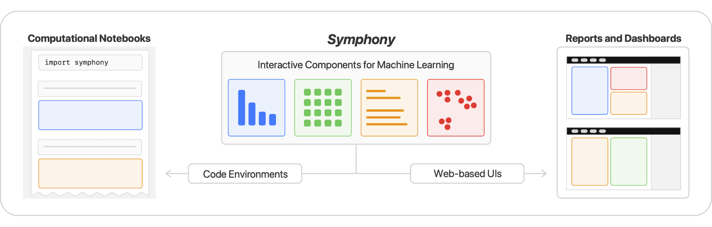

# Symphony: Composing Interactive Interfaces for Machine Learning

Symphony is a framework for composing interactive machine learning interfaces with task-specific, data-driven components that can be used across platforms such as computational notebooks and web dashboards. See Symphony's [documentation](https://apple.github.io/ml-symphony/) for more information.



This code accompanies the research paper:

**[Symphony: Composing Interactive Interfaces for Machine Learning](https://machinelearning.apple.com/research/composing-interactive-interfaces)**  
Alex Bäuerle*, Ángel Alexander Cabrera*, Fred Hohman, Megan Maher, David Koski, Xavier Suau, Titus Barik, Dominik Moritz  
*ACM Conference on Human Factors in Computing Systems (CHI), 2022.*  
[Paper][paper], [Code][code], [Preview][preview], [Video][video] \*Contributed equally

## Documentation

This repository consists of three main parts:

- [`symphony_ui`](./symphony_ui/): The main Symphony project, containing the framework.
- [`symphony_lib`](./symphony_lib/): A library that is used by both the framework and components to share common code.
- [`widgets`](./widgets/): Widgets that we provide as components and extensions to the project.

To install Symphony, run:

```bash
pip install symphony_ui
```

You can then install individual components, for example:

```bash
pip install symphony_summary
```

Optionally, you can install [all available components](https://apple.github.io/ml-symphony/components) with:

```bash
pip install "symphony_ui[widgets]"
```

Symphony works great with [DNIKit](https://github.com/apple/dnikit).
You can use DNIKit to generate analysis data for Symphony, for example for the Familiarity and Duplicates components.
If you want to run the precomputed Symphony example that uses DNIKit, run:

```bash
pip install "symphony_ui[examples]"
```

For information on how to use or contribute to Symphony, [see the documentation](https://apple.github.io/ml-symphony/).

## Contributing

When making contributions, refer to the [`CONTRIBUTING`](CONTRIBUTING.md) guidelines and read the [`CODE OF CONDUCT`](CODE_OF_CONDUCT.md).

## BibTeX

To cite our paper, please use:

```bibtex
@inproceedings{bauerle2022symphony,
  title={Symphony: Composing Interactive Interfaces for Machine Learning},
  author={Bäuerle, Alex and Cabrera, Ángel Alexander and Hohman, Fred and Maher, Megan and Koski, David and Suau, Xavier and Barik, Titus and Moritz, Dominik},
  booktitle={Proceedings of the SIGCHI Conference on Human Factors in Computing Systems},
  year={2022},
  organization={ACM},
  doi={10.1145/3491102.3502102}
}
```

## License

This code is released under the [`LICENSE`](LICENSE) terms.

[paper]: https://arxiv.org/abs/2202.08946
[code]: https://github.com/apple/ml-symphony/
[preview]: https://www.youtube.com/watch?v=Wf-YRBsI-wA
[video]: https://www.youtube.com/watch?v=0Q3wIh3AiPs