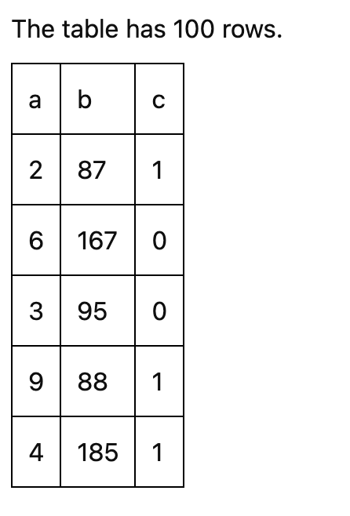

.. For licensing see accompanying LICENSE file.
.. Copyright (C) 2023 Apple Inc. All Rights Reserved.

********************
Creating a Component
********************

To create a new component, you can use a Python `cookiecutter` to get started, which provides the base code and boilerplate.

.. code-block:: bash

   pip install cookiecutter
   cookiecutter widget-cookiecutter/

The cookiecutter will guide you in filling out the necessary fields. 

.. warning::
   Your component name should be in the form of :code:`My Custom Component`. In turn, the identifier should be automatically prefixed with Symphony,
   e.g., :code:`SymphonyMyCustomComponent`. 

   Additionally, the npm package should be the identifier separated by dashes (:code:`symphony-my-custom-component`) and the python package
   separated by underscores (:code:`symphony_my_custom_component`).

Then install your component (using the `-e`` "editable" flag for development).

.. code-block:: bash 

    cd symphony_my_custom_component
    pip install -e .

If you start a Jupyter notebook and open the example notebook in :code:`/examples`, you should see a simple component showing the size of a table!

If you run the :code:`export(...)` cell, you can also run :code:`yarn dev` in the terminal to see the component as a standalone dashboard. 
Any changes you make to the frontend code will trigger a re-build, where you can refresh to see the changes.

==========
Background
==========

To customize a newly created component, the primary file to work in is :code:`src/[Your Provided Component Name].svelte`.

Components are written in Svelte.
See their `interactive tutorial <https://svelte.dev/tutorial/basics>`_ for a concise overview of the basics.

When customizing a component, you have access to all variables in the Symphony state.
To learn more about what each state variable is, see the :doc:`state` documentation.
Data tables are also stored as :code:`Arquero` tables, a columnar data API with transformations similar to Python Pandas or Apache Arrow.
The `official Arquero documentation <https://uwdata.github.io/arquero/>`_ is a great resource for working with tables.

Components can access helpers and UI elements from the `symphony_lib` npm package.
To learn more about available UI elements, see :doc:`common`.

===========
Development
===========

Assuming you have set up a development environment with Symphony and all its requirements installed (if not, see :doc:`contributing`),
in the component directory install and build all npm dependencies:

.. code-block:: bash

  yarn
  yarn build

Next, install the widget for Jupyter Notebook development.
Within the component directory, run:

.. code-block:: bash

  pip install -e .

Then, test if the widget works using the example Jupyter Notebook within the `examples` folder by running:

.. code-block:: bash

  jupyter notebook
  

To watch for changes in Jupyter Notebook, run:

.. code-block:: bash

  yarn watch
  
To watch for changes in Jupyter Lab, in another terminal window you also have to run:

.. code-block:: bash

  jupyter labextension watch
  
Then, refresh your browser to see any changes.

Lastly, to watch your changes and test your widget in a standalone app, run:

.. code-block:: bash

  yarn dev

For this to work, you need to call export once from the notebook.

Example: Creating a Simple Table Component
~~~~~~~~~~~~~~~~~~~~~~~~~~~~~~~~~~~~~~~~~~

Let's create a simple table component that behaves similar to Pandas' :code:`df.head()`.

The main file for building a component is :code:`src/[Your Provided Component Name].svelte`. 
As you make changes to this file, there are two ways to see your component:

1. Run :code:`yarn watch` and refresh the Jupyter Notebook.
2. Run :code:`yarn dev` and refresh the static website.

Note that you must have run :code:`symph.export("../symphony_my_custom_component/standalone")` from the examples folder at some point in order for :code:`yarn dev` to work.

At the top of the file, we can see all the data that is available to each component:

.. code-block:: typescript

    export let filter: WidgetWritable<string>;
    export let filterError: WidgetWritable<string>;
    export let table: Readable<ColumnTable>;
    export let symphonySpec: WidgetWritable<SymphonySpec>;
    export let groupColumns: WidgetWritable<string[]>;
    export let groupNames: WidgetWritable<string[][]>;
    export let groupedTables: Readable<ColumnTable[]>;
    export let filteredTable: Readable<ColumnTable>;
    export let selected: WidgetWritable<string[]>;
    export let tooltip: WidgetWritable<TooltipSpec>;
    export let showRaw: WidgetWritable<boolean>;

And we see how the component currently shows the size of the table:

.. code-block:: html 

    

        The table has {$table.size} rows.
    

To start our table, we create a header row with the name of each column: 

.. code-block:: html 

    <table>
      <thead>
        {#each $filteredTable.columnNames() as columnName}
          <td>{columnName}</td>
        {/each}
      </thead>
    </table>

And for the body, we sample 10 rows and show their values:

.. code-block:: html 

      <tbody>
        {#each $filteredTable.slice(0, 5).objects() as row}
          <tr>
            {#each Object.keys(row) as colKey}
              <td>{row[colKey]}</td>
            {/each}
          </tr>
        {/each}
      </tbody>

The resulting code would then be:

.. code-block:: html 

    <table>
      <thead>
        {#each $filteredTable.columnNames() as columnName}
          <td>{columnName}</td>
        {/each}
      </thead>
      <tbody>
        {#each $filteredTable.slice(0, 5).objects() as row}
          <tr>
            {#each Object.keys(row) as colKey}
              <td>{row[colKey]}</td>
            {/each}
          </tr>
        {/each}
      </tbody>
    </table>

After some CSS, you should see something similar to the following table:

